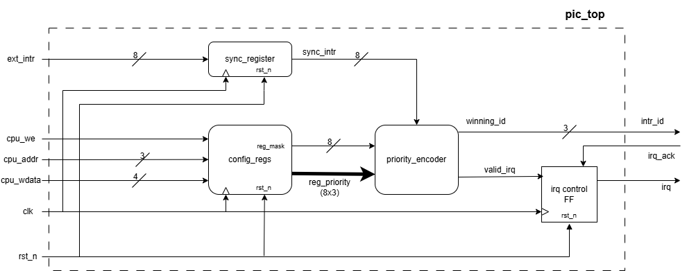

# Priority Interrupt Controller (PIC)

 RTL-designed Priority Interrupt Controller written in SystemVerilog. This project handles 8 external asynchronous interrupt channels, resolves priorities dynamically based on CPU configurations, and features a secure hardware-locking handshake mechanism to prevent data loss and glitches.

## Original Design & Architecture
The system was initially designed using a modular approach, consisting of three main RTL blocks and a top-level handshake controller.

### Core Modules:
1. **sync_register (2-Stage Synchronizer):** 
   External interrupts are often asynchronous and prone to metastability. This module safely samples the 8 external interrupt signals into the system's clock domain using a two-stage D-Flip-Flop synchronizer.
2. **config_regs (CPU Configuration Registers):** 
   Provides a memory-mapped interface for the CPU. It allows the software to dynamically write configuration data to mask specific channels or assign custom priority levels (0-7) to each of the 8 interrupt channels.
3. **priority_encoder (Combinational Resolver):** 
   A purely combinational block that takes the synchronized interrupts, filters out the masked ones, and selects the active channel with the highest programmed priority. If a tie occurs, it defaults to the lower channel index.

##  Verification & The Combinational Flaw
A testbench was built to verify the system against edge cases. However, during the verification process, two critical test cases failed, revealing a severe architectural flaw in the initial design.

### The Failed Scenarios:
* **Test 1.6 (Short Pulse):** Failed. An external interrupt spiked and dropped before the CPU could acknowledge it. The system failed to latch the ID, causing a "ghost" interrupt.
* **Test 1.9 (Two Consecutive Requests / Overwrite):** Failed. While the CPU was preparing to handle a valid interrupt, a higher-priority interrupt arrived. The system overwrote the `intr_id` mid-cycle, causing the original interrupt to be lost.

**The Cause:** In the original design, the `intr_id` output was routed directly from the combinational `priority_encoder`. This direct path meant the CPU output lacked a memory. Any real-time change in the external environment immediately corrupted the pending interrupt ID.

##  Updated Design 
To fix this, the architecture was upgraded from a purely combinational output to a Synchronous Registered Output with a hardware lock mechanism.

### The Fix:
* **Breaking the Combinational Path:** The output of the encoder is now an internal signal: `next_id`.
* **Sequential Control Block:** The `intr_id` was converted into a synchronous register (D Flip-Flop).
* **Locking Condition:** The register only samples `next_id` into `intr_id` under a strict condition:
  `if (valid_irq == 1 && irq == 0)`
  This ensures that once an interrupt is flagged (`irq` is high), the "door" is locked. No glitches or higher priority interrupts can overwrite the `intr_id` until the CPU safely finishes its routine and sends an `irq_ack` to clear the system.

##  Final Simulation & Results
After updating the RTL and modifying the testbench timings to account for the physical delays of the synchronizer and the new output register, the system worked as expected.

## Random Verification (Stress Testing)
I wanted to go beyond just writing manual tests for the edge cases I could think of. I learned that in the industry, verification relies heavily on randomization to catch hidden bugs. So, I decided to add a Randomized Stress Test (Test 1.10) to see how my design handles unexpected situations.

Using SystemVerilog's built in functions ($urandom and $urandom_range), I created a loop of 50 cycles where the testbench automatically does two things:
* **Random Interrupts:** Fires multiple interrupts simultaneously on completely random channels.
* **Random CPU Delays:** Waits a random amount of time (between 40ns and 150ns) before the CPU acknowledges the request, simulating a CPU that might be busy with other tasks.

**The Result:** I was really happy to see that the updated controller survived all 50 random cycles without crashing or losing data. The hardware lock that I added earlier did its job perfectly, protecting the system from glitches and overwrites even when the inputs were completly random. 

All test cases, including simultaneous collisions, glitches, and on the fly reconfigurations, now pass successfully. The controller safely queues and holds interrupts without data loss.